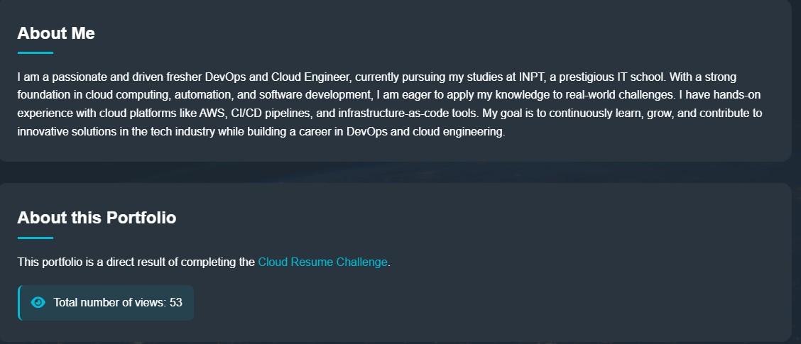

# ☁️ Cloud Resume Challenge

This project is my submission for the [Cloud Resume Challenge](https://cloudresumechallenge.dev/), a hands-on project designed by Forrest Brazeal to demonstrate practical skills in cloud computing, CI/CD, infrastructure-as-code, and more.

## 📄 Challenge Overview

The Cloud Resume Challenge includes a series of tasks that simulate real-world cloud project deployment. Below is a checklist of the components I implemented:

### ✅ Frontend
- [x] Created a resume as a responsive, styled HTML page.
- [x] Hosted the resume on **Amazon S3** as a static website.
- [x] Used **HTTPS** via Amazon CloudFront.
- [ ] Set up a custom domain with **Route 53** *(I didnt implement it)*.

### ✅ Backend
- [x] Created a **visitor counter** using **AWS Lambda**, **API Gateway**, and **DynamoDB**.
- [x] Wrote the backend in **Python**.
- [x] Connected the frontend to the backend using **JavaScript fetch()**.

### ✅ DevOps
- [x] Used **Infrastructure-as-Code (IaC)** to deploy resources (Using Terraform).
- [x] Configured **CI/CD pipelines** with GitHub Actions to automate deployment for frontend and clearing cloudfront cache.

---

## 🛠️ Technologies Used

- **Frontend**: HTML, CSS, JavaScript
- **Cloud Provider**: AWS (S3, CloudFront, API Gateway, Lambda, DynamoDB)
- **IaC**: Terraform
- **CI/CD**: GitHub Actions
- **Backend Language**: Python
- **Version Control**: Git + GitHub

---

## 🚧 Missing Part

- ❌ **DNS with Route 53** – This step was skipped in this project. A custom domain can be added later using Route 53 or an external DNS provider.
- ❌ **Unit tests** - This step was skipped as the python code wont be modified.

---

## 📷 Demo

